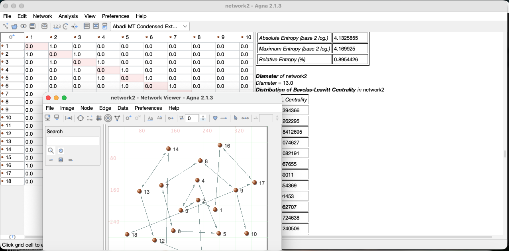

# AGNA

[](https://github.com/baeckett/AGNA/actions/workflows/ci.yml)
[](https://www.apache.org/licenses/LICENSE-2.0)



**AGNA — Applied Graph and Network Analysis Open Source** — is free desktop
and command-line software for **social network analysis, sociometry, and
sequential analysis**. It is designed for researchers, teachers, and students
who want to create, visualize, and analyze networks **without programming**.

Enter a sociomatrix in a spreadsheet-style grid, inspect it as a node/edge
graph, and run the classic measures: density, components, distances,
centrality, geodesics, shortest paths, cliques, and more. Networks import and
export in AGNA's own `.agn` format, plain text, CSV, Pajek `.net`, Excel
(`.xls`/`.xlsx`), GraphML, GML, and GraphSON; diagrams export to images and
vector graphics, and the command line renders networks headlessly for
reproducible workflows.

> If you just want to try it: see the
> [Quick Start](docs/QUICKSTART.md) or the
> [latest release](https://github.com/baeckett/AGNA/releases) for ready-made
> packages.

## Who is AGNA for?

AGNA is particularly suited to **small and medium research networks**:
communication, collaboration, affiliation, interaction, behavioral,
institutional, historical, and other relational data. It is used in
sociology, anthropology, communication research, psychology, education,
organizational research, animal-behavior studies, and the humanities. The
original author, [Marius Ion Bența](https://www.netanalysis.co.uk), built it
(2001–2005) as a friendly alternative to programming environments; **2.1.3**
is the open-source revival of that work, modernized and fully tested.

## The three components

| Component | Purpose | Primary audience |
|-----------|---------|------------------|
| **AGNA Desktop** | Graphical network creation, visualization, and analysis | Researchers, students, teachers |
| **AGNA Core** | Java library: network models, analyses, transformations, rendering, formats | Developers and research-software projects |
| **AGNA CLI** | Command-line analysis, reproducible workflows, diagram generation | Advanced users, scripts, automation |

```
AGNA Desktop ──────► AGNA Core ◄────── AGNA CLI
(graphical UI)         (engine)        (command line)
```

The components share one architecture: **Desktop** provides the graphical
interface, **Core** provides the reusable engine, and **CLI** exposes Core
functions for scripted, reproducible work. All three are released under the
**Apache License 2.0**.

## What you can do

- **Build networks** — create and edit directed, undirected, binary, and
  valued networks through matrices, tables, and graphical views.
- **Explore structure** — inspect density, components, distances, centrality,
  sociometric patterns, and other network properties.
- **Visualize relations** — use the integrated visual editor to arrange,
  inspect, and export readable network diagrams.
- **Teach and learn** — work with the bundled example networks
  (`samples/`) and the [user manual](docs/manual.md).
- **Automate** — repeat analyses from a terminal with AGNA CLI
  ([reference](docs/cli.md), `--help` lists every command).

## Quick start

The shortest path to a first analysis is the
[Quick Start](docs/QUICKSTART.md) — about ten minutes, using the bundled
`Example 1` network: open the file, inspect the graph, run the basic
measures, and export the results.

## Installation

All installers bundle the Java runtime; no separate Java installation is
needed. Choose your platform from the
[latest release](https://github.com/baeckett/AGNA/releases):

- **Windows** — [setup (.msi)](https://github.com/baeckett/AGNA/releases/download/v2.1.3/AGNA-2.1.3-1-windows-setup.msi) ·
  [setup (.exe)](https://github.com/baeckett/AGNA/releases/download/v2.1.3/AGNA-2.1.3-1-windows-setup.exe)
- **macOS** — [setup (.dmg)](https://github.com/baeckett/AGNA/releases/download/v2.1.3/AGNA-2.1.3-2-macos-setup.dmg)
- **Linux** — [Debian/Ubuntu .deb](https://github.com/baeckett/AGNA/releases/download/v2.1.3/AGNA-2.1.3-3-linux-setup.deb) ·
  [Fedora/RHEL .rpm](https://github.com/baeckett/AGNA/releases/download/v2.1.3/AGNA-2.1.3-3-linux-setup.rpm) ·
  [portable x64 archive](https://github.com/baeckett/AGNA/releases/download/v2.1.3/AGNA-2.1.3-Linux-x64.tar.gz)

All installers are **64-bit**. The macOS `.dmg` is built for **Apple
Silicon (arm64)** — an Intel-macOS build can be produced if needed. Windows
and Linux installers target x64/amd64, so a 32-bit Windows cannot install
them.

Users with Java 17+ can also run the self-contained desktop jar directly:

```
java -jar AGNA-2.1.3-desktop.jar
```

### Build from source

Requires JDK 17 and Maven.

```
mvn verify      # compile + run the full correctness suite (239 tests)
                # performance benchmarks: mvn verify -Pbenchmarks
mvn package     # builds the jars in each module's target/
java -jar agna-desktop/target/agna-2.1.3.jar        # desktop
java -jar agna-cli/target/agna-cli-2.1.3.jar --help # CLI
```

On first start the bundled node-face images are materialized under
`~/.agna/faces`. All text I/O is UTF-8.

## Repository layout

```
agna-core/      engine: networks, analyses, layouts, import/export
agna-cli/       command-line interface (info, analyse, convert, transform,
                draw, generate, metrics, ...)
agna-desktop/   the desktop application (Swing)
samples/        original sample networks (kept byte-identical)
docs/           user manual, CLI reference, quick start, man page
website/        project website draft (source for netanalysis.co.uk)
packaging/      installer recipes (macOS dmg, icons), signing guide
CITATION.cff    machine-readable citation metadata (Zenodo DOI)
```

## License

Apache License 2.0 — see [LICENSE](LICENSE). No warranty; use at your own
discretion.

## High-Risk Activities Disclaimer

AGNA is provided for research, educational, and general analytical purposes.
It is not designed, developed, tested, certified, or intended for use in
hazardous or safety-critical environments requiring fail-safe performance.
Without limitation, AGNA must not be used for the design, construction,
operation, maintenance, monitoring, or control of nuclear facilities;
aircraft, aviation navigation, aviation communications, or air-traffic
control systems; direct life-support or life-critical medical systems;
weapons systems; emergency-response control systems; or any other activity in
which a failure, error, delay, interruption, or inaccurate output could
reasonably be expected to result in death, personal injury, or severe
physical, environmental, or property damage. Any use of AGNA in such high-risk
activities is entirely at the user’s own risk. To the maximum extent permitted
by applicable law, the author and contributors disclaim all warranties,
whether express, implied, statutory, or otherwise, including any warranty of
fitness for high-risk activities.

## Citation

If you use AGNA in your research, please cite it (see also
[CITATION.cff](CITATION.cff) and [CITATION.bib](CITATION.bib)):

> Bența, M. I. (2026). *AGNA: Applied Graph and Network Analysis Open Source*
> (Version 2.1.3) [Computer software]. https://doi.org/10.5281/zenodo.22708199

## Links

- Website: https://www.netanalysis.co.uk
- Contact: contact@netanalysis.co.uk
- Copyright 2001–2026 Marius Ion Bența
- [Acknowledgements](ACKNOWLEDGEMENTS.md)